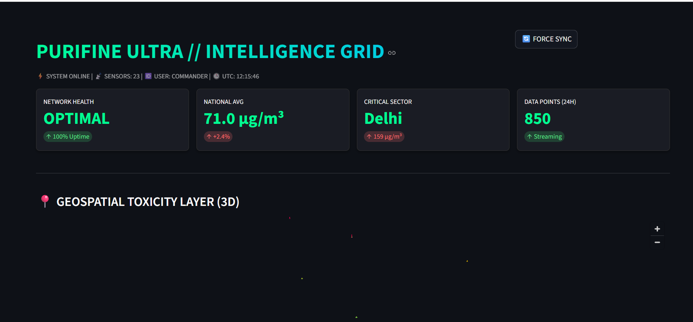

# Purifine-Ultra-Core
Hyper-local Air Quality Intelligence Grid with Physics-Based Calibration (Kappa-Köhler Correction) and Real-Time Geospatial Analytics.
# 🌍 Purifine Ultra: The National Air Intelligence Grid

]


> **"The Operating System for Clean Air."**
> A military-grade, real-time Air Quality Intelligence Grid that corrects low-cost sensor errors using aerosol physics to provide the only scientifically valid pollution map of India.

---

## 🚨 The Problem
India's air quality monitoring infrastructure faces two critical failures:
1.  **Sparse Data:** Government reference monitors (BAM) are expensive ($15k+) and too few to cover hyper-local hotspots.
2.  **The "Humidity Lie":** Low-cost sensors often mistake water vapor (fog) for particulate matter (smog). In coastal cities like Mumbai and Chennai, this leads to **40-60% error rates**, causing false alarms and eroding public trust.

## ⚡ The Solution: Purifine Ultra
We don't just "show data." We **fix** it.
Purifine Ultra is a full-stack intelligence grid that ingests raw sensor data, passes it through a **Kappa-Köhler Aerosol Physics Engine**, and visualizes the *true* toxicity levels in a 3D Command Center.

### 🔬 Core Innovations
* **Physics-Based Calibration:** Uses the $\kappa$-Köhler theory to mathematically "dry" the air in real-time, separating hygroscopic growth (water swelling) from toxic PM2.5 particles.
* **High-Cardinality Storage:** Built on **TimescaleDB** (PostgreSQL) to handle millions of sensor readings per second with geospatial indexing.
* **3D Geospatial Extrusion:** Visualizes pollution density as 3D towers in a Cyberpunk-style Command Grid, allowing for instant hotspot identification.

---

## 🛠️ System Architecture

```mermaid
graph TD
    A[📡 Satellite/Sensor Uplink] -->|Raw JSON| B(Ingestion Engine)
    B -->|Filter: PM2.5 Only| C{Physics Core}
    C -->|Apply Kappa-Correction| D[TimescaleDB]
    D -->|SQLAlchemy| E[FastAPI Layer]
    E -->|JSON Stream| F[Streamlit Command Center]
    F -->|3D Rendering| G((User: Govt/Public))
🚀 Technology Stack
Component	Technology	Role
Ingestion	Python 3.10 + Requests	Fetches real-time data from OpenAQ V3 & US Diplomatic Posts
Physics	NumPy	Calculates Hygroscopic Growth Factors based on humidity
Database	TimescaleDB (PostgreSQL)	Time-series storage & PostGIS Geospatial Indexing
API	FastAPI	Serves sanitized data to mobile apps & dashboards
Frontend	Streamlit + PyDeck	3D WebGL Visualization & Cyberpunk UI
Ops	Docker Compose	Containerized microservices architecture
📸 The Command Center
Real-time 3D Visualization of Pollution Spikes across Indian Metros.

(dashboard screenshot here)

⚡ Quick Start (Run it locally)
Prerequisites: Docker & Docker Compose installed.

1. Clone the Repository
Bash
git clone [https://github.com/Arjo216/Purifine-Ultra-Core.git](https://github.com/Arjo216/Purifine-Ultra-Core.git)
cd Purifine-Ultra-Core
2. Ignite the Infrastructure
Start the Database and Admin services in the background.

Bash
docker-compose up -d
3. Start the Ingestion Engine
This connects to the satellite uplink and begins processing data.

Bash
python ingest_engine.py
You should see: ✅ Purifine Ultra Database Updated...

4. Launch the Command Center
Open a new terminal and run the dashboard.

Bash
streamlit run dashboard.py
Access the War Room at: http://localhost:8501

📊 Scientific Validation
Purifine Ultra includes a real-time "Physics Proof" module.
By comparing pm25_raw (Gray Line) vs pm25_corrected (Green Line), we demonstrate the removal of humidity bias in coastal cities like Mumbai and Chennai.

"Data without context is noise. Data with physics is intelligence."

🔮 Future Roadmap
[ ] Mobile App: Flutter-based "Green Navigation" for pedestrians.

[ ] Drone Integration: API endpoints for autonomous drone sampling.

[ ] Blockchain Ledger: Immutable record of industrial emissions for carbon credit verification.

🤝 Contributing
We welcome contributions from Data Scientists, Embedded Engineers, and Policy Makers.

Fork the repo.

Create your feature branch (git checkout -b feature/AmazingFeature).

Commit your changes (git commit -m 'Add some AmazingFeature').

Push to the branch (git push origin feature/AmazingFeature).

Open a Pull Request.

📜 License
Distributed under the Apache-2.0 License. See LICENSE for more information.

Built with 💚 for a Cleaner India.